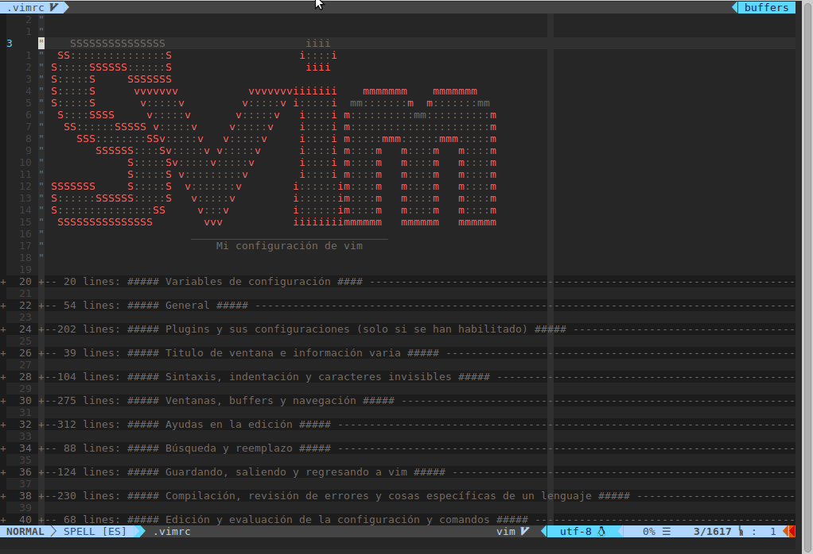
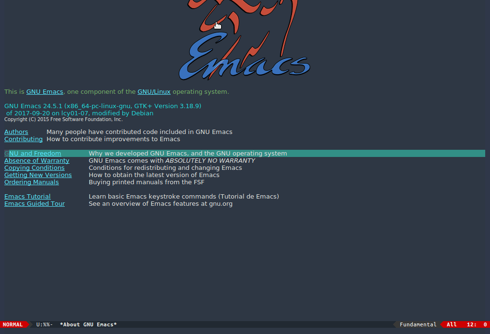
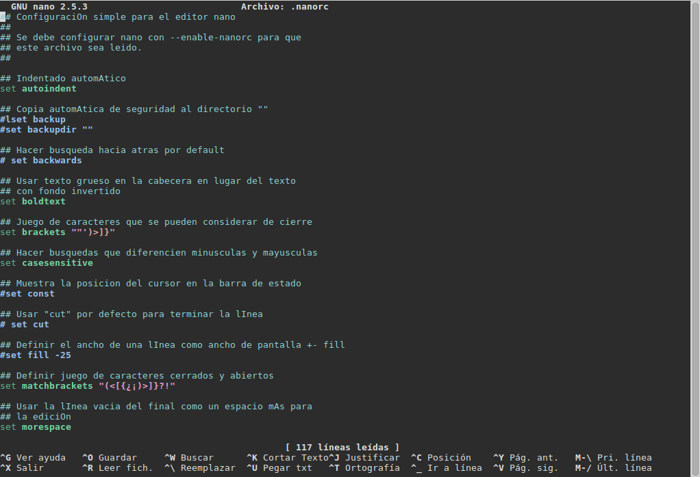

# dotfiles

My personal configuration files for bash, nano, [neo]vim and emacs and also a
script to install my work/leisure programs. All the contents here used to be a
bunch of messy and inefficient configurations only suited for my personal needs
but with the time they have become into a messy and inefficient configurations
that are still pretty good and easy to be used by others.
********************************************************************************
Mis archivos de configuración personales para bash, nano, [neo]vim y emacs así
como un script para instalar mis programas de trabajo/ocio. Estos contenidos
solían ser un manojo de enmarañadas e ineficientes configuraciones únicamente
aptas para mis necesidades personales, pero con el tiempo se han convertido en
un manojo de enmarañadas e ineficientes configuraciones que también son
perfectamente usables por otros.

## Contents / Contenidos

1. [Vim](#vim)
2. [Emacs](#emacs)
3. [Nano](#nano)
4. [Bash](#bash)
5. [Others / Otros](#others)

## Vim

A folder with all vim-related configs and a script to install all.
********************************************************************************
Una carpeta con todas las configuraciones relacionadas con vim y un script para
instalar todo.

## Emacs

A folder with all emacs-related configs.
********************************************************************************
Una carpeta con todas las configuraciones relacionadas con emacs.

## Bash

The file "nanorc" which contains a small config of nano.
********************************************************************************
El archivo "nanorc" el cual contiene una pequeña configuración de nano.

## Others / Otros

The file "bashrc" with some aliases for bash/zsh, the script
"install_my_apps.sh" to install programs I use and two configuartions files for
clang-tidy with my preferred styles for C-based languages named "clang-format1"
and "clang-format2"
********************************************************************************
El archivo "bashrc" con algunos alias para bash/zsh, el script
"install_my_apps.sh" para instalar programas que uso y dos archivos de
configuración para clang-tidy con mis estilos preferidos para lenguajes basados
en C llamados "clang-format1" y "clang-format2"
